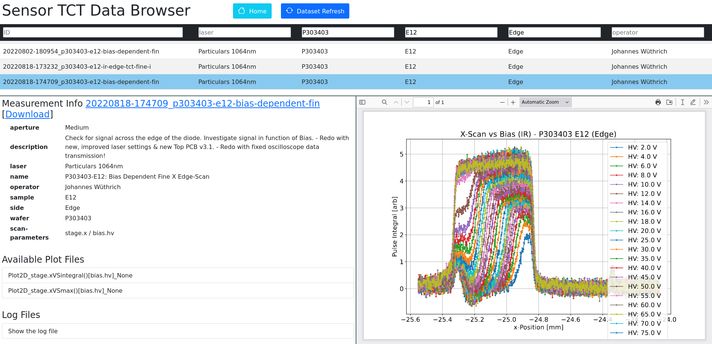
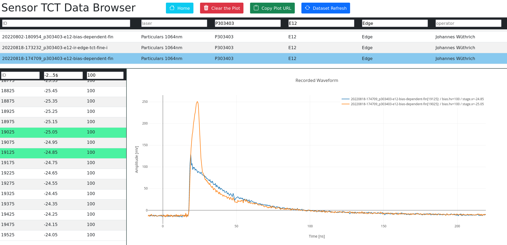
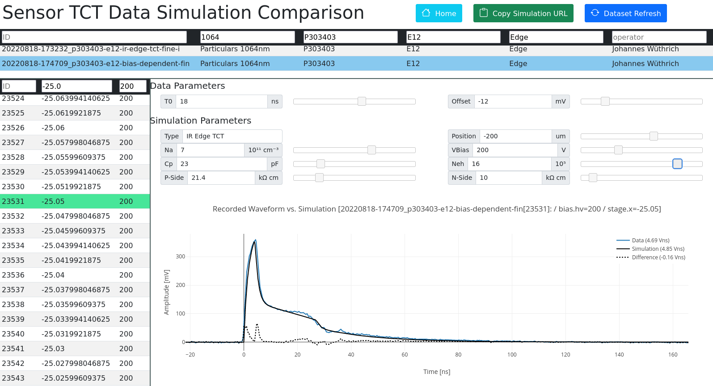

# Online Data View for the TCT Setup at ETHZ (Rubbia-Group)

This repository implements an online (webserver) data view utility, for presenting the data acquired with the ETHZ TCT Setup.
This utility is closely linked to the [ETHZ TCT Control framework](https://github.com/deragent/ETHZ-TCT-Control).
It was developed as part of the PhD thesis work of Johannes Wüthrich.
The corresponding PhD thesis will be linked here in the future.

## Framework Structure

## Usage

### Config
TODO

### Interface Views
The home page links to three different views:

#### Data Overview Page
A view of the data overview pages is given here:

On the data overview page, a list of all acquired datasets can be found in a table, allowing to filter for certain meta properties.
When selecting a dataset the full metadata, the list of online analysis plots and the config of the selected scan is shown.
The online analysis plots can directly be viewed in the browser.

#### Time Domain Data Browser
The time domain data browser allows to visualize the acquired time domain data signals.
Signal acquired via different scans can be compared.
A view of this page is shown below:

#### Simulation Interface
The interface view allows to compare a selected time domain waveform with the predicted waveform based on the simple simulation model incorporating the extended Shockley-Ramo theorem.
This view is closely linked to the data acquired with the bonded diode samples, presented in the PhD thesis.
The simulation is fully parameteric and the parameters can be changed on the fly.
A view of this interface is shown below:

## Requirements
As the online interface is heavily based on the [ETHZ TCT Control framework](https://github.com/deragent/ETHZ-TCT-Control), the requirements for the mentioned framework also apply here.
The web-server itself is implemented with [Flask](https://flask.palletsprojects.com/).

### Python packages
The following additional python packages are necessary:

- flask

### Bootstrap
The online interface makes use of the bootstrap framework and the bootstrap-icons collection.
Both of these are contained within the repository under `static/`.

### TCT Control: analysis module
TODO
